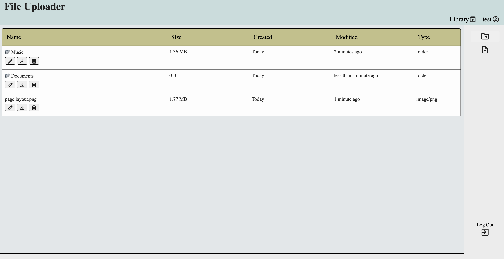
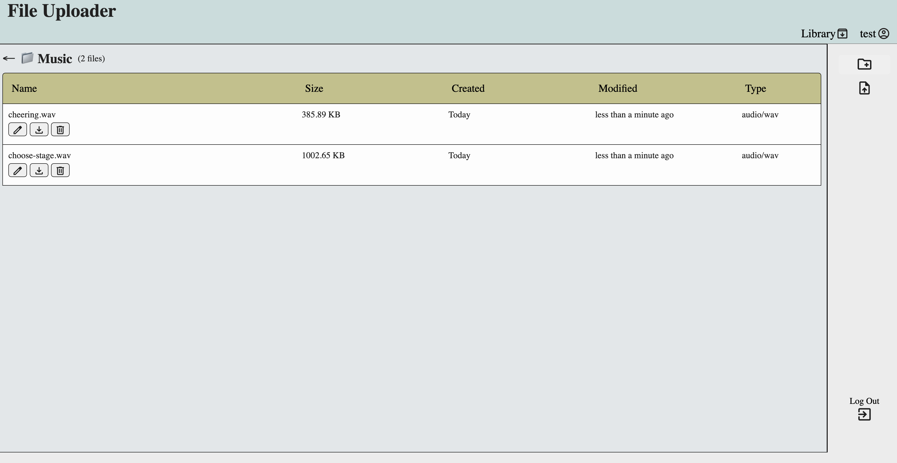

# file-uploader

Create a file storage website. The website allows you to upload files and download them if you create an account. It's a project to test backend database storage in cloud services like Supabase and databse management using Prisma.

## Website url

https://file-uploader-hyhw.onrender.com/

## Screenshots

## Library/Frameworks

- **backend**: Node.js, Express
- **Database**: PostgreSQL, Prisma
- **Authentication**: Passport.js (Local strategy)
- **File Storage**: Supabase, Multer
- **Validation**: express-validator
- **Utilities**: date-fns
